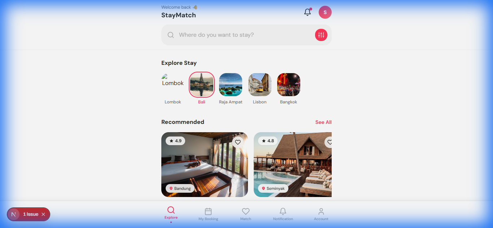
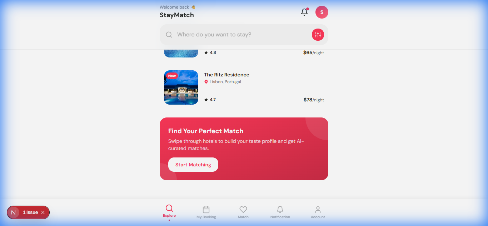
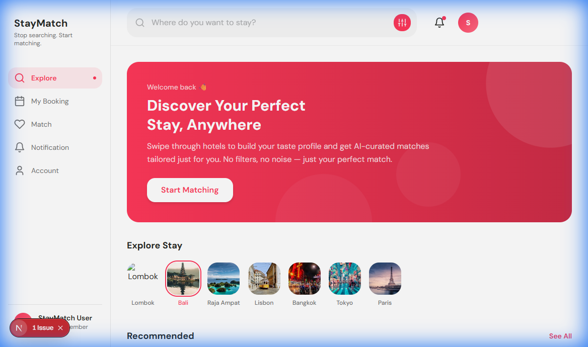
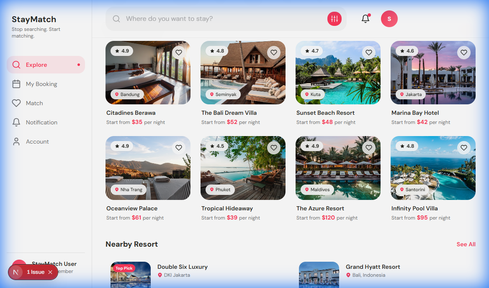
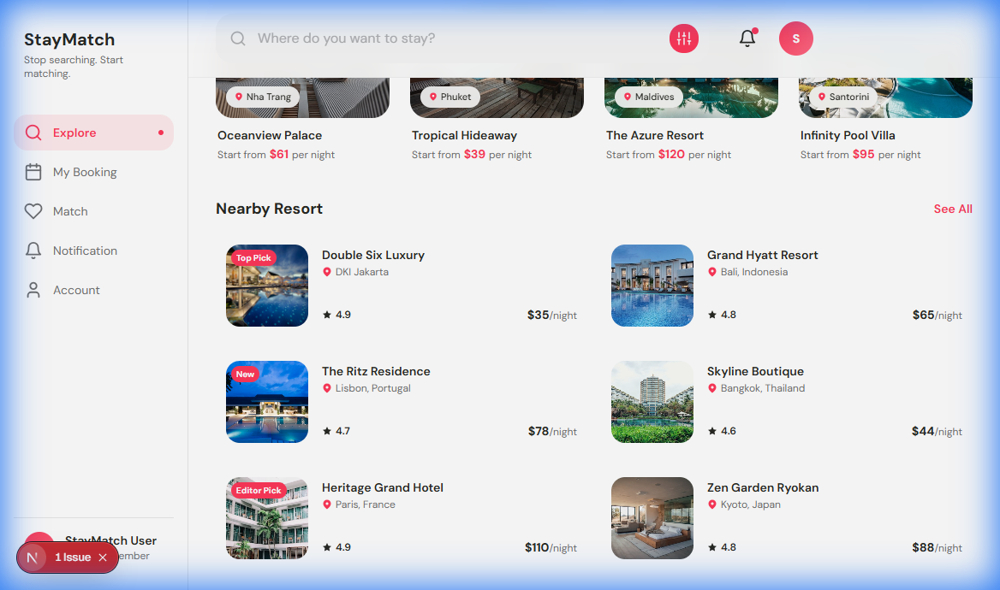

# StayMatch Design System — Walkthrough

## What Changed

Complete visual overhaul from a dark/purple theme to a clean, light hotel-booking app using brand colors:
- **White** (`#FFFFFF`) — backgrounds
- **Coral Red** (`#FF3859`) — primary accent
- **Dark Charcoal** (`#272823`) — text

## Files Modified

| File | Change |
|------|--------|
| [tailwind.config.ts](file:///home/staymatch.co/tailwind.config.ts) | New color tokens, semantic aliases, shadows, animations |
| [globals.css](file:///home/staymatch.co/app/globals.css) | Light theme CSS vars, component classes, utilities |
| [layout.tsx](file:///home/staymatch.co/app/layout.tsx) | Removed dark mode, white theme color |
| [page.tsx](file:///home/staymatch.co/app/page.tsx) | Full landing page with search, categories, cards, CTA |

## New Components

| Component | Purpose |
|-----------|---------|
| [Button.tsx](file:///home/staymatch.co/components/ui/Button.tsx) | 3 variants (primary/secondary/ghost), 3 sizes, loading state |
| [SearchBar.tsx](file:///home/staymatch.co/components/ui/SearchBar.tsx) | Search input with filter button |
| [CategoryPill.tsx](file:///home/staymatch.co/components/ui/CategoryPill.tsx) | Horizontal scroll destination selectors |
| [PropertyCard.tsx](file:///home/staymatch.co/components/ui/PropertyCard.tsx) | Standard + compact layouts with favorites |
| [BottomNav.tsx](file:///home/staymatch.co/components/ui/BottomNav.tsx) | 5-tab bottom nav + desktop sidebar |

---

## Mobile Verification

**Build**: ✅ `npm run build` — 0 errors

````carousel

<!-- slide -->

<!-- slide -->

````

---

## Responsive Desktop Layout

Adapted mobile-first design to a full desktop experience at `lg` breakpoint (1024px+).

### Desktop Changes

| Component | Mobile | Desktop |
|-----------|--------|---------|
| BottomNav | Fixed bottom bar | Left sidebar with brand, nav, profile |
| PropertyCard | `w-60` (scroll) | `w-full` (grid) |
| Recommended | Horizontal scroll | 4-column CSS grid |
| Nearby Resort | Vertical list | 2-3 column CSS grid |
| Header | Compact with search | Full-width search bar |
| CTA | Inline banner | Hero banner with gradient |

### Desktop Verification (1400×900)

````carousel

<!-- slide -->

<!-- slide -->

````

### Recordings

- [Design system preview](media/design-system-preview.webp) — initial design session
- [Design system screenshots](media/design-system-screenshots.webp) — mobile screenshot captures
- [Desktop layout recording](media/desktop-layout-recording.webp) — desktop verification session
