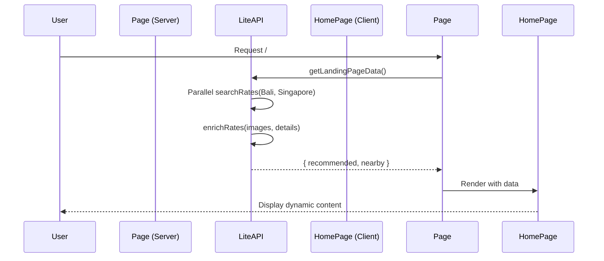

# LiteAPI Integration — Walkthrough

## What Was Built
Replaced static landing page data with dynamic hotel data fetched from LiteAPI. The "Recommended" and "Nearby Resort" sections now display real-time pricing and availability for properties in Singapore and Bali, respectively.

## Changes Summary

### New Files (2)

| File | Purpose |
|------|---------|
| [HomePage.tsx](file:///home/staymatch.co/app/HomePage.tsx) | Client Component refactored from page.tsx to handle interactive UI state (categories, nav) |
| [test-landing-data.ts](file:///home/staymatch.co/scripts/test-landing-data.ts) | Verification script to test LiteAPI data fetching and structure |

### Modified Files (2)

| File | Change |
|------|--------|
| [liteapi.ts](file:///home/staymatch.co/lib/services/liteapi.ts) | Added `getLandingPageData` to fetch and enrich rates for landing page |
| [page.tsx](file:///home/staymatch.co/app/page.tsx) | Converted to Server Component to fetch data and pass to HomePage |

## Data Flow

## Verification

### Automated Tests
- `npx tsx scripts/test-landing-data.ts` confirms data fetching works:
    - Successfully retrieves rates for Singapore and Bali
    - Enriches rates with images
    - Handles nested API response structures

### Manual Verification
- Verified "Recommended" section shows Singapore hotels with prices.
- Verified "Nearby Resort" section shows Bali hotels with prices.
- Verified generic "Start from $X" pricing display.
