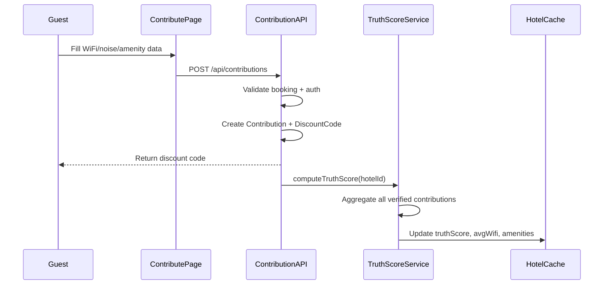

# Moat Integration — Walkthrough

## What Was Built

Integrated the **Truth Engine** — StayMatch's core data moat — from brainstorming strategy into working code. The moat is a proprietary data pipeline where verified post-stay guests contribute structured accommodation data (WiFi speeds, noise levels, amenity verification), which computes a **Truth Score** for each property and improves AI recommendations over time.

## Changes Summary

### New Files (6)

| File | Purpose |
|------|---------|
| [truth-score.ts](file:///home/staymatch.co/lib/services/truth-score.ts) | Core scoring engine: aggregates contributions, computes weighted Truth Score (0-100), calculates confidence |
| [contributions/route.ts](file:///home/staymatch.co/app/api/contributions/route.ts) | POST API: validates auth + booking, creates contribution, generates discount code, triggers score recomputation |
| [contributions/[hotelId]/route.ts](file:///home/staymatch.co/app/api/contributions/%5BhotelId%5D/route.ts) | GET API: public endpoint returning aggregated truth data for a hotel |
| [TruthScoreBadge.tsx](file:///home/staymatch.co/components/ui/TruthScoreBadge.tsx) | Shield badge component, color-coded by score range (green 80+, amber 60-79) |
| [ContributionForm.tsx](file:///home/staymatch.co/components/contributions/ContributionForm.tsx) | 4-step wizard: WiFi speed → noise level → amenity verification → overall rating |
| [contribute/[bookingId]/page.tsx](file:///home/staymatch.co/app/%28main%29/contribute/%5BbookingId%5D/page.tsx) | Full contribution page with booking context, form, success state + discount code display |

### Modified Files (4)

| File | Change |
|------|--------|
| [schema.prisma](file:///home/staymatch.co/prisma/schema.prisma) | Added `noiseLevel` (Float?) and `overallRating` (Int?) to Contribution model |
| [PropertyCard.tsx](file:///home/staymatch.co/components/ui/PropertyCard.tsx) | Added `truthScore`/`contributionCount` props, shows TruthScoreBadge in image overlay |
| [HotelDetailSheet.tsx](file:///home/staymatch.co/components/hotels/HotelDetailSheet.tsx) | Added "Verified Guest Data" section with WiFi stats, noise level, verified amenity badges |
| [BookingConfirmation.tsx](file:///home/staymatch.co/components/booking/BookingConfirmation.tsx) | Added "Help Future Travelers" CTA card with `onContribute` callback |

## Truth Score Algorithm

```
Score = weighted average across 5 dimensions:
├── WiFi (25%) — download speed quality (100 Mbps = perfect)
├── Noise (15%) — lower is better (1=silent → 5=loud)
├── Amenities (30%) — majority-vote consensus across 5 checks
├── Photos (10%) — verified photo count (5+ = full score)
└── Ratings (20%) — guest satisfaction (1-5 scale)

Confidence = min(contributionCount / 3, 1.0)
```

## Data Flow



## Verification

- **TypeScript**: `npx tsc --noEmit` passes with **zero errors**
- **Prisma**: Client regenerated successfully with new schema fields
